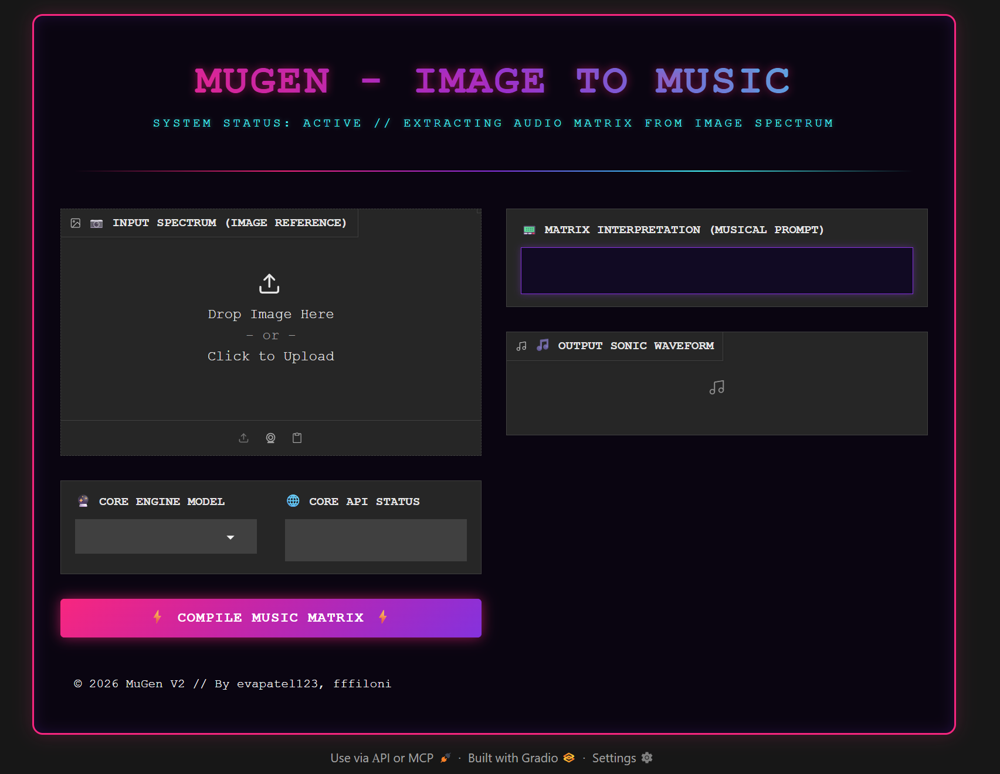

# ⚡ MuGen V2: Image to Music Matrix ⚡

MuGen V2 is a cyberpunk-themed web application built with Gradio that transforms images into music. The system utilizes image captioning networks, LLM prompt engineering, and bleeding-edge audio generation APIs to compose soundtrack matrices tailored to the mood of an image.

## 🔮 Core Features
* **Visual Spectrography:** Image processing using the Kosmos-2 visual language model.
* **Neural Prompt Alignment:** Uses `zephyr-7b` via an inference pipeline to interpret visual metadata into sophisticated musical compositions/chords.
* **Multi-Engine Audio Synthesis:** Integrated routing support for `AudioLDM-2`, `Riffusion`, `Mustango`, and more.
* **Premium Cyberpunk UI:** Custom Neon injected CSS styling for a high-end terminal experience.

## 🚀 Getting Started

### Prerequisites
Make sure you have Python 3.10+ and a Hugging Face API Token.

### Installation
1. Clone the repository:
   ```bash
   git clone [https://github.com/YOUR_USERNAME/MuGen-V2.git](https://github.com/YOUR_USERNAME/MuGen-V2.git)
   cd MuGen-V2
   
### Other Credits
Used ffilioni API clients from HuggingFace.

###  Preview
Preview on Hugging Face: https://huggingface.co/spaces/eva1267890/MuGen
Note: You may or may not need a HuggingFace account for viewing this space.

### Screenshot
<p align="center">
  
</p>
